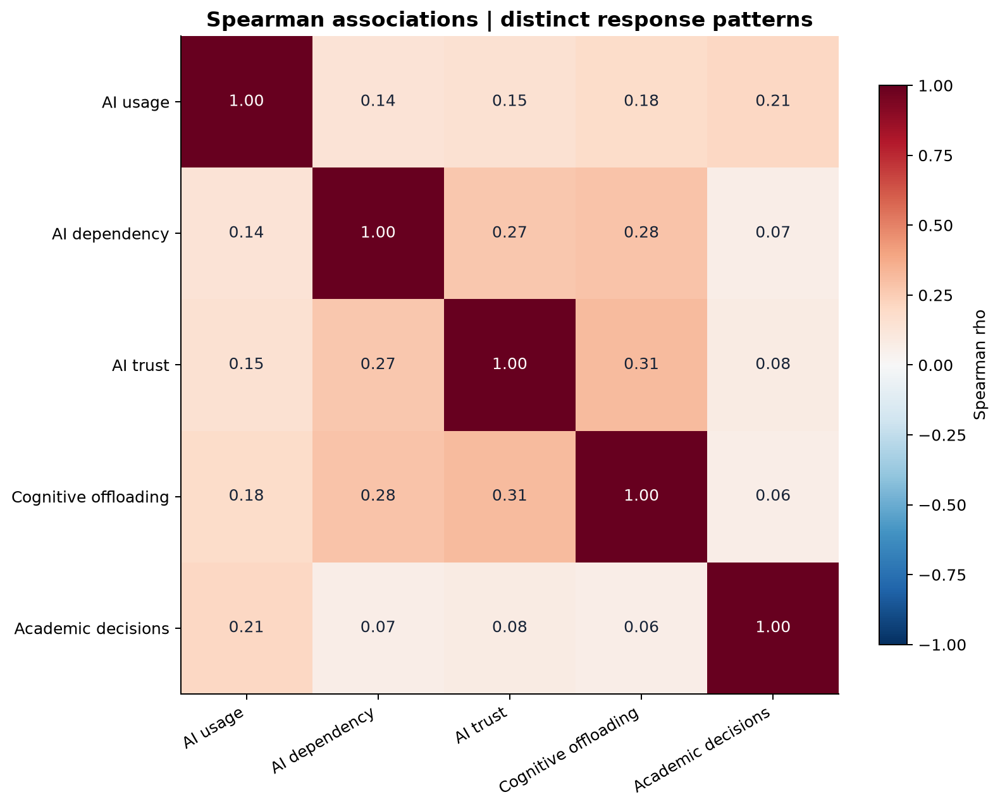
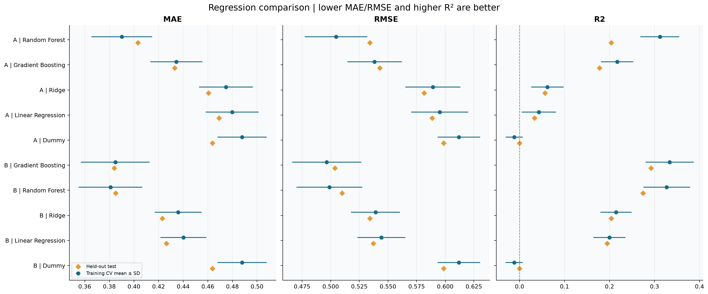
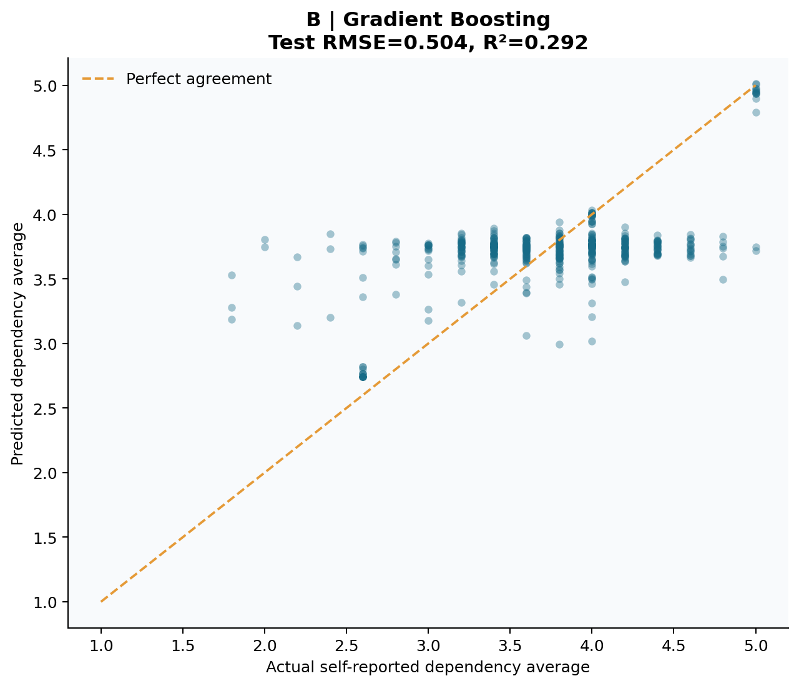
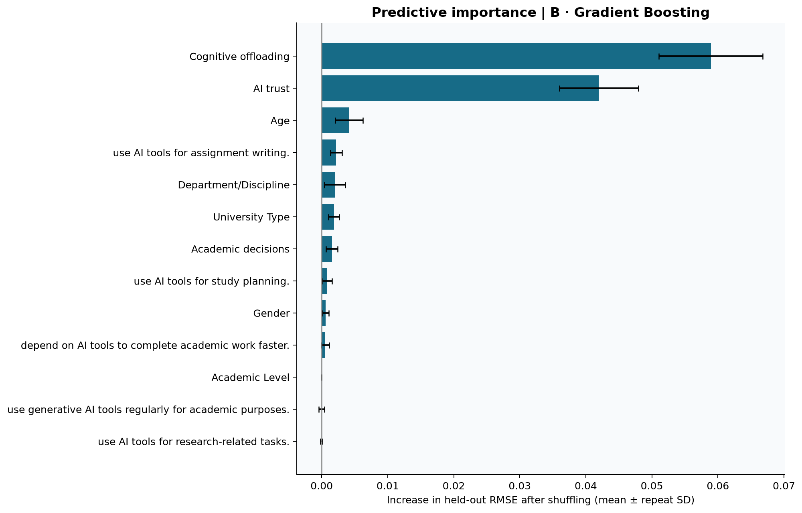
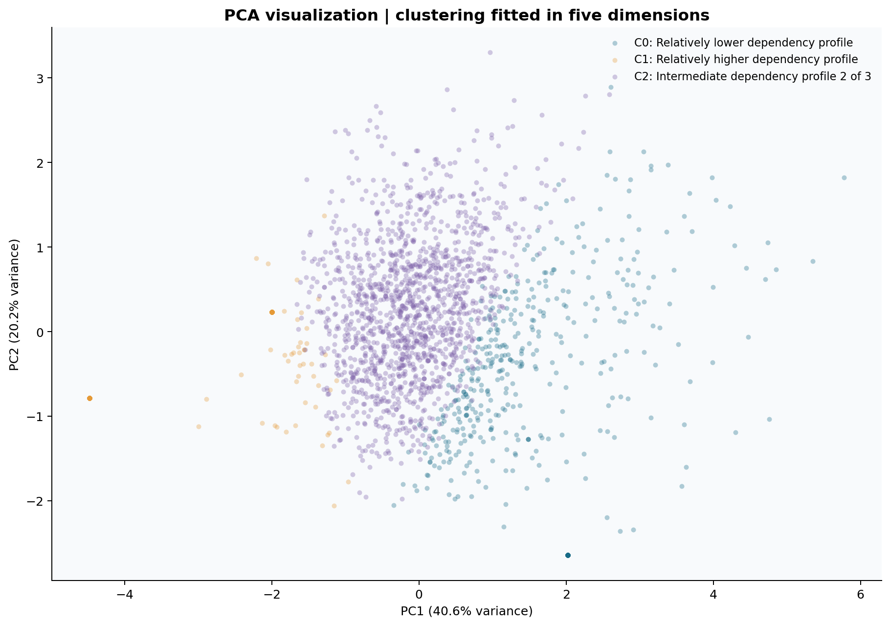
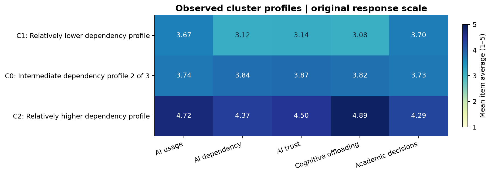

# AI Dependency and Cognitive Offloading Among University Students

An explainable machine-learning portfolio project that examines self-reported academic use of generative AI, AI dependency, trust in AI, cognitive offloading, and AI-influenced academic decision-making among university students in Bangladesh.

**Live demo:** [Open the Streamlit prediction app](https://ai-dependence-and-cognitive-offloading-lcpccta7q8vcncxa5epke8.streamlit.app/)

> The app returns an exploratory estimate of the AI Dependency Index from questionnaire responses. It is not a psychological or clinical assessment, a measure of intelligence or cognitive ability, or a basis for decisions about an individual.

## Project overview

This study uses a cross-sectional self-report survey with **2,613 responses** and **30 columns**. It combines a transparent data audit, reliability analysis, Spearman correlations, non-parametric group comparisons, leakage-aware regression, permutation importance, and K-Means clustering.

The central outcome is the **AI Dependency Index**, defined as the mean response to the five cognitive-dependence survey items on the original 1-5 Likert scale. Higher values indicate greater **self-reported cognitive dependence on AI**. The index is an exploratory survey composite; it does not measure intelligence, memory, or clinical impairment.

## Live Streamlit demo

The deployed application asks visitors for demographics and 20 questionnaire responses covering AI use, trust, cognitive offloading, and academic decision-making. It then uses the saved Gradient Boosting pipeline to return an estimated AI Dependency Index.

**[Launch the interactive demo](https://ai-dependence-and-cognitive-offloading-lcpccta7q8vcncxa5epke8.streamlit.app/)**

The five dependency items are deliberately excluded from the form because they construct the prediction target. This prevents direct target leakage.

## Dataset and data-quality audit

| Check | Result |
| --- | ---: |
| Raw responses | 2,613 |
| Original columns | 30 |
| Missing values | 0 |
| Exact duplicate rows beyond the first copy | 451 |
| Primary analysis sample | 2,162 distinct complete response patterns |
| Survey response scale | Strongly Disagree to Strongly Agree, encoded 1-5 |

The duplicate records could represent repeated submissions or different students giving identical full-response patterns. Because respondent identifiers were unavailable, the primary analysis gives each distinct complete pattern equal weight. Analyses using all rows are treated as sensitivity checks rather than proof about duplicate provenance.

## Analytical workflow

1. **Audit and cleaning** - validated the schema, response labels, missingness, duplicates, demographics, and all 25 Likert items before encoding.
2. **Constructs and reliability** - identified five item groups programmatically and calculated Cronbach's alpha before creating exploratory item-average indices.
3. **Exploratory analysis** - summarized demographics and index distributions; assessed monotonic associations with Spearman correlation and Holm-adjusted p-values.
4. **Group comparisons** - compared dependency and cognitive-offloading indices across gender, university type, and academic level using assumption-aware non-parametric tests.
5. **Regression** - predicted the continuous AI Dependency Index with an 80/20 held-out split and five-fold cross-validation on training data only.
6. **Explainability** - used held-out permutation importance for the selected model.
7. **Clustering** - standardized the five index variables, compared K-Means solutions for k=2 to k=6, and visualized the selected solution with PCA.

### Leakage controls

The five Cognitive Dependence items create the target and are never used as model predictors.

- **Model A:** five AI-use items plus gender, age, university type, academic level, and department/discipline.
- **Model B:** Model A plus AI Trust, Cognitive Offloading, and Academic Decision-Making indices.

Model B is an associational prediction model. Its related survey constructs must not be interpreted as causes or as an early-warning system. Preprocessing is fitted inside a scikit-learn `Pipeline` and `ColumnTransformer` on training folds only.

## Key results

### Reliability evidence

The primary distinct-pattern analysis found weak internal consistency for several exploratory composites. Alpha is evidence about internal consistency in this sample; it does not establish construct validity.

| Exploratory index | Items | Cronbach's alpha |
| --- | ---: | ---: |
| AI Usage | 5 | 0.333 |
| AI Dependency | 5 | 0.323 |
| AI Trust | 5 | 0.284 |
| Cognitive Offloading | 5 | 0.529 |
| Academic Decision-Making | 5 | 0.221 |

These results are a key limitation. The composites and all downstream model outputs should be read as exploratory rather than as validated psychometric scores.

### Associations

Primary correlations use Spearman's rho because the indices are derived from ordinal Likert responses. All p-values below are Holm-adjusted.

| Relationship | Spearman rho | Holm-adjusted p-value | Interpretation |
| --- | ---: | ---: | --- |
| AI Usage and AI Dependency | 0.140 | 1.33e-10 | Positive monotonic association |
| AI Dependency and Cognitive Offloading | 0.284 | 7.80e-41 | Positive monotonic association |
| AI Trust and AI Dependency | 0.269 | 1.58e-36 | Positive monotonic association |
| AI Dependency and Academic Decision-Making | 0.067 | 0.0019 | Small positive monotonic association |

These cross-sectional associations do not establish causation.

### Regression performance

Models were selected by mean five-fold cross-validation RMSE on the training split, then evaluated once on the held-out test split.

| Feature set | Best model | CV RMSE | Test MAE | Test RMSE | Test R<sup>2</sup> |
| --- | --- | ---: | ---: | ---: | ---: |
| Model A: AI-use items + demographics | Random Forest | 0.505 | 0.403 | 0.534 | 0.204 |
| Model B: Model A + related survey indices | Gradient Boosting | 0.497 | 0.384 | 0.504 | 0.292 |

The selected **Gradient Boosting Model B** improves on the mean-prediction baseline, but its held-out R<sup>2</sup> shows that substantial variation remains unexplained. It is not externally validated.

### Variables useful for prediction

Held-out permutation importance ranked **Cognitive Offloading** (mean RMSE increase 0.0587) and **AI Trust** (0.0428) as the strongest inputs for the selected model. This ranking describes model reliance for prediction; correlated survey inputs and cross-sectional data mean it does not identify causal effects.

### Student profiles

Among K-Means solutions from k=2 to k=6, **k=3** had the highest silhouette score (**0.220**). The clusters summarize response patterns, including relatively lower, intermediate, and relatively higher dependency profiles. The modest silhouette score, weak scale reliability, and absence of external validation mean that these clusters should not be treated as naturally occurring student types.

## Visual results

<table>
  <tr>
    <td width="50%" align="center">
      <strong>Spearman correlation heatmap</strong><br>
      
    </td>
    <td width="50%" align="center">
      <strong>Regression model comparison</strong><br>
      
    </td>
  </tr>
  <tr>
    <td width="50%" align="center">
      <strong>Held-out actual versus predicted values</strong><br>
      
    </td>
    <td width="50%" align="center">
      <strong>Held-out permutation importance</strong><br>
      
    </td>
  </tr>
  <tr>
    <td width="50%" align="center">
      <strong>K-Means profiles in PCA space</strong><br>
      
    </td>
    <td width="50%" align="center">
      <strong>Cluster profiles on the original scale</strong><br>
      
    </td>
  </tr>
</table>

More figures are available in [`outputs/figures/`](outputs/figures/), including demographic distributions, index distributions, group comparisons, residual diagnostics, the elbow curve, and silhouette scores.

## Project structure

```text
.
├── app.py                                  # Streamlit questionnaire and prediction interface
├── FINAL_REPORT.md                         # Detailed written research report
├── FINAL_REPORT.html                       # Browser-friendly report and figure gallery
├── requirements.txt                        # Reproducible Python dependencies
├── outputs/
│   ├── figures/                            # EDA, modelling, and clustering visualizations
│   ├── models/
│   │   ├── best_regression_pipeline.joblib # Saved selected prediction pipeline
│   │   └── model_metadata.json             # Feature contract and model metadata
│   ├── tables/                             # Statistical and modelling result tables
│   └── results_summary.json                # Machine-readable project summary
└── .streamlit/config.toml                  # Streamlit theme configuration
```

## Reproduce the analysis

The original CSV is intentionally not included in the public repository. It contains row-level survey data and must be shared only with appropriate permission. The executed analysis notebook is kept locally for the same reason.

To run the deployed application from a clone, install the pinned dependencies and start Streamlit with Python 3.11:

```powershell
python -m pip install -r requirements.txt
python -m streamlit run app.py
```

The saved pipeline was trained with **scikit-learn 1.2.2**. Joblib model files
are not guaranteed to load across scikit-learn versions. If the app reports a
missing module such as `sklearn.ensemble._gb_losses`, repair the active Python
environment and restart Streamlit:

```powershell
python -m pip install --upgrade --force-reinstall "scikit-learn==1.2.2"
python -m streamlit run app.py
```

For the most reproducible local setup, create a clean Python 3.11 virtual
environment and install the full pinned `requirements.txt` file before running
the app.

For Streamlit Community Cloud, select `app.py` as the entrypoint and choose **Python 3.11** in Advanced settings. The live deployment is available at the link above.

## Ethical use and limitations

- All measures are self-reported and cross-sectional; the results are associative, not causal.
- The AI Dependency Index is not a clinical diagnosis or a measure of intelligence, memory, or cognitive ability.
- Weak primary reliability estimates limit measurement confidence and model interpretation.
- Exact duplicate response patterns lacked respondent identifiers, so their origin is unknown.
- The model is trained on this sample only and has not received external validation.
- The Streamlit demo does not save questionnaire submissions and should not be used for ranking, diagnosis, admissions, discipline, or other high-impact decisions.

## Evidence status and deployment boundaries

The released model card and evidence-status note distinguish results that were
actually evaluated from diagnostics that have not yet been run. The project has
one internal held-out evaluation and an all-rows duplicate-sensitivity analysis;
it does **not** yet have external validation, continuous-score calibration
results, or subgroup prediction-performance results. The demo must remain an
exploratory educational tool and must not assign risk labels or support
individual decisions.

- [Model card](MODEL_CARD.md) — intended use, feature contract, performance, and limitations
- [Evidence status and evaluation gaps](EVIDENCE_STATUS.md) — duplicate-sensitivity interpretation and a minimum next-evaluation plan

## Reports and artifacts

- [Final research report](FINAL_REPORT.md)
- [HTML report](FINAL_REPORT.html)
- [Model comparison table](outputs/tables/model_comparison.csv)
- [Reliability table](outputs/tables/reliability.csv)
- [Spearman association table](outputs/tables/spearman_relationships.csv)
- [Permutation importance table](outputs/tables/permutation_importance_best.csv)
- [Model card](MODEL_CARD.md)
- [Evidence status and evaluation gaps](EVIDENCE_STATUS.md)
- [Live Streamlit demo](https://ai-dependence-and-cognitive-offloading-lcpccta7q8vcncxa5epke8.streamlit.app/)
